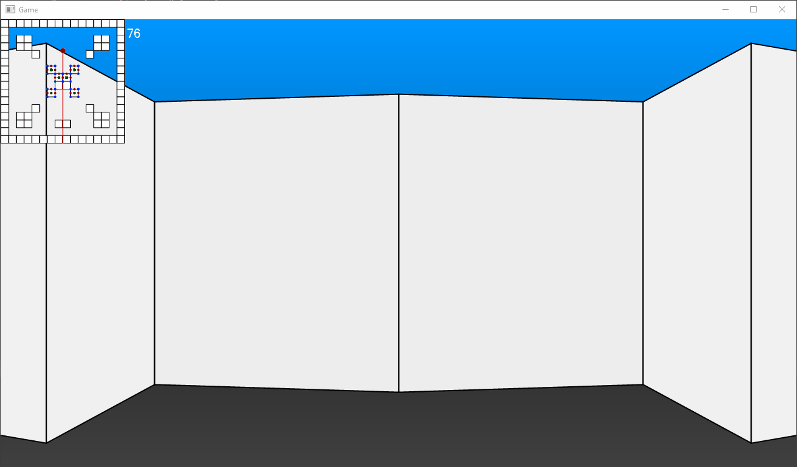

# DoomGame
Doom-ish clone made in the Saxion GXP Engine
Check the [GitHub repo](https://github.com/TechnicJelle/DoomGame) for the most up-to-date version!

### The switch to a horror game

### When Enemies were just added

### Textured walls, now sorted correctly!

Also visible in this GIF are the textures on the minimap and the hot-reloading from Tiled level files!

## Really outdated GIFs
### Blank walls, all perfect sorting

(Also contains a small bit of flickering sides, but I'm hoping that once I've implemented DDA, that that'll go away)

### Textured walls, with still wrong sorting

## Modifications made in response to code reviews from peers
- DDA Explanation (c45417f899148e795a2580724a68c698a95f6c53)
- Added option to turn off the minimap (1b3504d35ed8745b698903e07395aeef654ea8a9)
- Added extra comments to some methods (066980ecbbf82c06ae5b8c479799aee96e05d01b)
